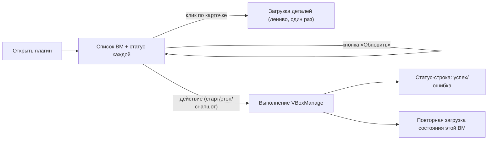

# Использование плагина

Это руководство — для человека, который открывает плагин VirtualBox в Cockpit и управляет виртуальными машинами через браузер. Про установку и деплой плагина на сервер — см. [README.md](../README.md#релиз) и агентский skill [docs/skills/devops/cockpit-plugin-install.skill/](skills/devops/cockpit-plugin-install.skill/cockpit-plugin-install.skill.md).

## Как это работает

Плагин появляется в боковом меню Cockpit (пункт "VirtualBox") и целиком выполняется в браузере: никакого отдельного бэкенда нет. Все действия — список машин, статус, детали, старт/стоп, снапшоты — это вызовы `VBoxManage` через `cockpit.spawn()`, то есть команда реально выполняется на том сервере, где открыт Cockpit, от имени залогиненного в Cockpit пользователя. Поэтому:

- Список машин и их состояния показывают только то, что видно этому пользователю (`VBoxManage list vms` от его имени).
- Если у пользователя нет прав на VirtualBox или `VBoxManage` не установлен — плагин покажет ошибку в строке статуса.

Данные не обновляются в фоне сами по себе — обновление происходит по действию:

- Кнопка **"Обновить"** в шапке перезагружает весь список машин.
- Раскрытие карточки (клик по строке с именем машины) подгружает детали один раз и кэширует их, пока карточка раскрыта; повторный клик сворачивает и сбрасывает кэш — следующее раскрытие снова запросит актуальные данные.
- После любого действия (старт, пауза, снапшот и т.д.) состояние конкретной машины запрашивается заново, но список остальных карточек не трогается.

## Какие функции есть

**Список машин**
- Показывает все ВМ, видимые `VBoxManage`, с именем и статусом (точка-индикатор + текст: "Запущена", "На паузе", "Выключена", "Сохранено состояние", "Аварийно завершена").
- Кнопка "Обновить" — ручной пересчёт списка.

**Управление питанием** (набор кнопок зависит от текущего статуса машины):
| Статус машины | Доступные действия |
| --- | --- |
| Запущена | Пауза, Сохранить состояние, ACPI выключение (мягкое, как кнопка питания), Force off (жёсткое выключение) |
| На паузе | Продолжить, Force off |
| Выключена / сохранено состояние / аварийно завершена | Запустить (headless — без окна) / Запустить (GUI — с окном на сервере) |

Во время выполнения действия кнопка блокируется и подсвечивается, чтобы не отправить команду дважды.

**Детали машины** (открываются кликом по карточке):
- Общая информация, сети, носители, USB, общие папки — полный список полей ниже.

**Снапшоты** (кнопка "Снапшоты" открывает модальное окно для выбранной машины):
- Список существующих снапшотов.
- Создание нового снапшота по введённому имени.
- Восстановление машины на любой снапшот из списка одной кнопкой.

**Строка статуса** в шапке всегда показывает результат последнего действия ("Готово: <имя ВМ>", "Ошибка: ...") или время последнего обновления списка.

## Какую информацию выводит

При раскрытии карточки машины показываются пять блоков:

- **Общая** — CPU, объём памяти (МБ), тип гостевой ОС, порт VRDE (или "выключен", если удалённый доступ отключён).
- **Сети** — по каждому адаптеру: номер слота, тип подключения (NAT / bridge / host-only / internal / generic), MAC-адрес, включён ли кабель, правила проброса портов (`имя: протокол host_ip:host_port → guest_ip:guest_port`).
- **Носители** — тип (HDD или DVD/ISO), путь к файлу образа, размер.
- **USB устройства** — имя фильтра (с производителем и VID:PID, если известны), подключено ли устройство сейчас, включено ли автоподключение.
- **Общие папки** — имя папки, путь на хосте, путь в гостевой ОС, доступна ли только для чтения, включено ли автомонтирование.

Если у машины нет сетей/носителей/USB/папок — вместо таблицы показывается сообщение "Нет ...".

## Известные ограничения

- Список и статусы не опрашиваются автоматически (нет polling) — чтобы увидеть изменение, сделанное вне плагина (например, из терминала), нажмите "Обновить" или сверните/разверните карточку.
- Все операции требуют, чтобы `VBoxManage` был доступен в `PATH` пользователя, под которым запущен `cockpit-bridge`, и чтобы у этого пользователя были права на управление нужными ВМ.
